<h1 align="center">
  
</h1>

<h5 align="center">
  <code><a href="https://www.linkedin.com/in/vipin-kumar-049a7a1a0/" title="LinkedIn Profile"> LinkedIn</a></code>
  <code><a href="https://www.hackerrank.com/profile/vipinkumar212003" title="HackerRank Profile"> HackerRank</a></code>
  <code><a href="https://stackoverflow.com/users/23180258/vipin-kumar" title="Stack Overflow Profile"> Stack Overflow</a></code>
  <code><a href="https://www.instagram.com/vipinkumar212003/" title="Instagram Profile"> Instagram</a></code>
</h5>
 

  Hello! 👋 I’m Vipin Kumar, a Software Engineer at Findoc and an Undergraduate at Polaris School of Technology.
  
  
 🚀 Currently specializing in <b>AI & Machine Learning</b>, I bridge the gap between robust backend systems and intelligent automation. My journey includes contributing to open-source via <b>GSoC 2024 (Monumento)</b> and building scalable financial microservices.
  
  
 📖 <b>Beyond the Code:</b> I’m a firm believer in continuous learning—whether it’s diving into finance and entrepreneurship through books or exploring the intersection of tech and commerce.
  
  
 🎵 When I’m not shipping code, I’m likely recharging with some music to keep the creative gears turning. 
  
  
 I love collaborating on innovative projects and exploring the "what's next" in tech. Let’s connect!
   
   
  💬 Ask me anything about from <a href="https://github.com/issues" title="Issues">Here</a>
   
  📫 How to reach me: <a href="mailto: vk.bsn002@gmail.com">vk.bsn002@gmail.com</a>

<h2 align="center">🔥 Languages & Frameworks & Tools & Abilities 🔥</h2>
 

  <code></code>
  <code></code>
  <code></code>
  <code></code>
  <code></code>
  <code></code>
  <code></code>
  <code></code>
  <code></code>
  <code></code>
  <code></code>
  <code></code>
  <code></code>
  <code></code>
  <code></code>
  <code></code>
  <code></code>
  <code></code>
  <code></code>
  <code></code>

<h2 align="center">🏆 Trophies 🏆</h2>

<h2 align="center">⚡ Stats ⚡</h2>
 

  

    
    
  

           
  

    
  

   

  

<!---
<h2 align="center">👨‍💻 Repositories 👨‍💻</h2>
 

  

     
<h4 align="center">
  <a href="https://github.com/vkprogrammer-001?tab=repositories" title="Show Repositories">🔎 Show More 🔍</a>
</h4>
--->

